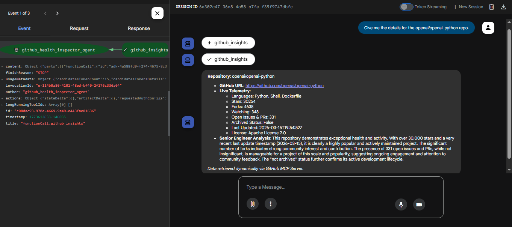

# 🩺 Project: GitHub Health Inspector Agent
**GenAI Academy - Professional Project Submission**

## 🎯 Problem Statement
Build and deploy a *single AI agent* using *ADK and Gemini* that is hosted on *Cloud Run* and utilizes the *Model Context Protocol (MCP)* to perform *one clearly defined task* by integrating with an external API.

This is a professional project focused on advanced agent structure, secure API tool calling, and serverless deployment, showcasing a production-ready AI workflow.

## 📋 Project Scope
This project focuses on the development and deployment of an intelligent **GitHub Health Inspector Agent**. The core objective was to create a specialized AI tool capable of fetching live telemetry from the GitHub REST API via a local FastMCP server, and transforming that raw data into objective, actionable insights for Senior Engineers, while maintaining strict operational guardrails.

### 🎯 What We Achieved:
* **Single Capability Focus:** Specialized in the **Evaluation and Analysis** of open-source GitHub repositories.
* **Live Tool Integration (MCP):** Successfully implemented a FastMCP server over `stdio` to securely bridge the LLM with the public GitHub API without exceeding rate limits.
* **Intelligent Telemetry Analysis:** Leveraged **Gemini 2.5 Flash** with dynamic temporal context to evaluate polyglot languages, stars, forks, active issues/PRs, and archived status.
* **Custom Persona & Guardrails:** Configured the agent to ignore non-technical queries, ensuring it remains a focused enterprise tool.
* **Cloud-Native Serverless Architecture:** Deployed via **Google Cloud Run** for automatic scaling, packaging both the ADK agent and the FastMCP server in a single container.
* **Enterprise Identity Management:** Implemented a dedicated **IAM Service Account** with scoped permissions to Vertex AI, adhering to the Principle of Least Privilege.

---

## 🛠️ Technical Implementation

### 1. The Agent Logic (`agent.py` & `github_mcp.py`)
The agent is built using the **Google Agent Development Kit (ADK)** and **FastMCP**. It is programmed with a strict system instruction set that handles critical states:
1.  **Greeting:** Identifies itself and its purpose immediately upon connection.
2.  **Repository Task:** Dynamically routes requests to the `repo_details` MCP action, formatting live metrics and a Senior Engineer Analysis.
3.  **Search Task:** Routes category searches to the `search_top` MCP action to discover high-quality dependencies.
4.  **Formatting:** Returns responses in clean, structured Markdown, prioritizing the repo name and URL.
5.  **Scope Guarding:** Rejects requests outside the scope of repository health and open-source coding.

### 2. Infrastructure Stack
* **Compute:** Google Cloud Run (Exposed via HTTP Endpoint)
* **AI Engine:** Vertex AI (Gemini 2.5 Flash)
* **Tooling Protocol:** Model Context Protocol (MCP) via `stdio`
* **Environment:** Python 3.11 / UV Virtual Environment
* **Identity:** Custom IAM Service Account (`mcp-service-auth`)

---

## Implementation Guide

Full setup steps and source code are available here:

[Implementation Steps](docs/implementation_steps.md)

---

## 🌐 Accessing the Agent (ADK Web UI)
Upon successful deployment, the terminal will output a public Service URL.
(Example: `https://github-health-inspector-agent-12345abcde-uc.a.run.app`)
Click or paste this URL into your web browser.
The link will automatically load the ADK Web UI, providing a clean, built-in chat interface.
You can immediately start interacting with the Health Inspector directly on the UI using the test cases below.

| # | User Input | Expected Response (Approximate) |
| :--- | :--- | :--- |
| 1 | `"Hello"` | "Hello! I am the GitHub Health Inspector Agent, and I use live MCP data to evaluate open-source repositories." |
| 2 | `"Can you run a health check on the openai/openai-python repo?"` | **Repository:** openai/openai-python <ul><li>**GitHub URL:** https://github.com/openai/openai-python</li><li>**Live Telemetry:**<ul><li>Languages: Python, Shell, Dockerfile</li><li>Stars: 30254</li><li>Forks: 4638</li><li>Watching: 348</li><li>Open Issues & PRs: 331</li><li>Archived Status: False</li><li>Last Updated: 2026-03-15T19:54:52Z</li><li>License: Apache License 2.0</li></ul></li><li>**Senior Engineer Analysis:** This repository displays robust health metrics. Its impressive star count and significant number of forks are indicative of strong community adoption and a thriving ecosystem...</li></ul>*Data retrieved dynamically via GitHub MCP Server.* |
| 3 | `"what are the top 3 mcp server github repos with python"` | Here are the top 3 MCP server GitHub repos with Python:  1. **PrefectHQ/fastmcp** Stars: 23697 Primary Language: Python Last Updated: 2026-03-15T20:51:56Z Health Note: Highly popular and very actively maintained, with continuous recent development. URL: https://github.com/PrefectHQ/fastmcp  2. **oraios/serena** Stars: 21551 Primary Language: Python Last Updated: 2026-03-15T22:07:06Z Health Note: Very popular and actively maintained. URL: https://github.com/oraios/serena  3. **BeehiveInnovations/pal-mcp-server** Stars: 11252 Primary Language: Python Last Updated: 2026-03-15T19:01:59Z Health Note: Popular and actively maintained. URL: https://github.com/BeehiveInnovations/pal-mcp-server  *Data retrieved dynamically via GitHub MCP Server.* |